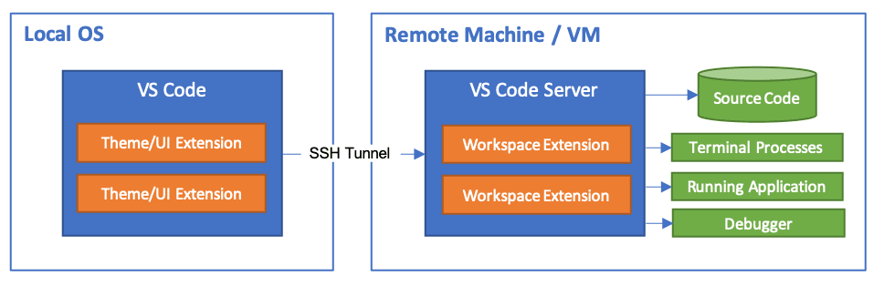
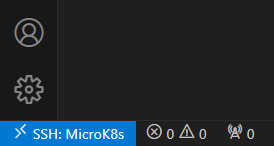

Den Go Code für unseren Kubernetes Scheduler möchte ich in der VisualStudioCode (VSC) IDE auf meinem Windows Rechner schreiben. 
Dafür wird eine SSH Verbindung von VSC zu der Linux VM benötigt. 
Mithilfe der Erweiterung [Remote - SSH](https://code.visualstudio.com/docs/remote/ssh) kann dies leicht erreicht werden. 


Mit ++f1++ kann die Befehlsanzeige von VSC aufgemacht werden und nach `Remote-SSH: Connect to Host...` gesucht werden. 
Wenn der Command ausgewählt ist, kann entweder eine neue SSH Host Konfigurationsdatei angelegt werden oder 
direkt mit `<user>@<host>` eine SSH Verbindung aufgebaut werden. 
Die File wird standardmäßig unter `C:\Users\<username>\.ssh` gespeichert. 
Zuletzt wird die Eingabe im Command bestätigt und man muss beim Ausführen bzw. Verbinden noch im Kontextmenue das Betriebssystem wählen.

```bash
Host MicroK8s
  HostName 172.30.169.161
  User ubuntu
```

Sobald die Verbindung steht, 
wird unten Links in VSC in Blau der Aktuelle Host angezeigt - in meinem Fall `MicroK8s`. 



# Programmierung im Terminal mit Neovim 

Alternativ arbeiten wir direkt in der VM mit [Neovim](https://neovim.io/). 
Mir persönlich gefällt das Arbeiten in VSC besser, 
daher bevorzuge ich das oben beschriebene Setup mehr. 
Von der Leistung oder Effizienz unterscheiden sich beide Methode nicht, 
es ist eine einfache Präferenz. 