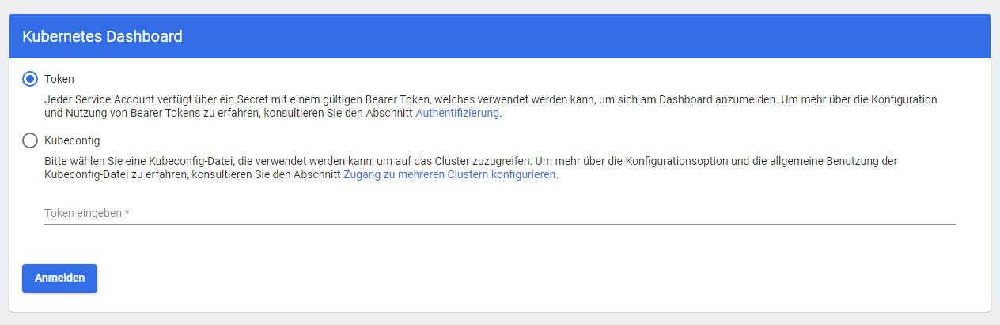
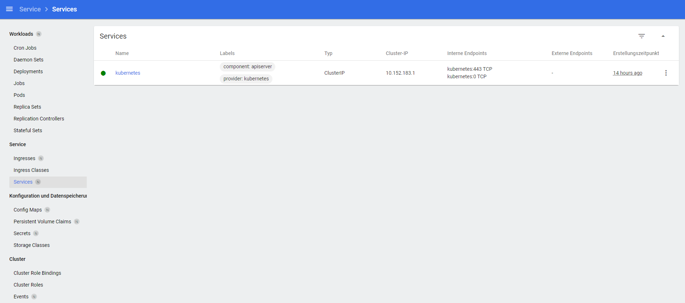
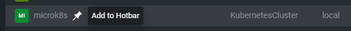
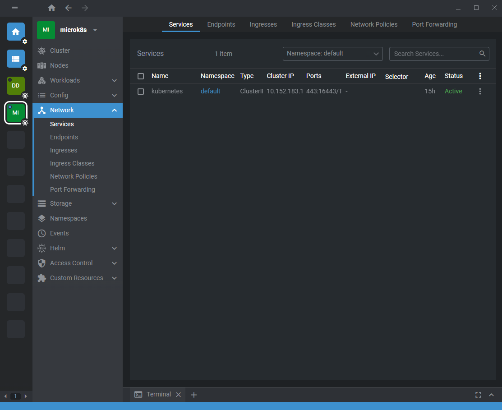
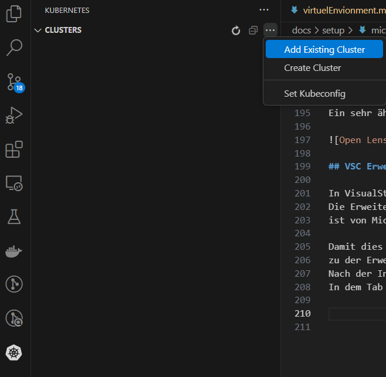

Damit wir mit dem Projekt starten können und unsere Fragestellung direkt angehen können, 
wollen wir zuerst ein prove of work Konzept in einem kleinen lokalem MikroK8s Cluster testen. 

# Einrichten eines MicroK8s Clusters in der VM

In der Linux VM kann nun mit folgenden Befehlen ein MicroK8s Cluster installiert werden. 
Die Dokumentation folgt die Anweisungen aus dem offiziellen [MicroK8s Webpage](https://microk8s.io/docs/getting-started).
<br>
`$ sudo snap install microk8s --classic` <br>
`$ sudo microk8s status --wait-ready` <br>
`$ sudo microk8s enable dns` <br>
`$ sudo microk8s enable registry` <br>
`$ sudo microk8s enable istio` <br>


<details>
<summary>Command Outputs:</summary>

```bash
ubuntu@microk8s-vm:~$ sudo snap install microk8s --classic
2024-09-25T23:22:39Z INFO Waiting for automatic snapd restart...
microk8s (1.30/stable) v1.30.4 from Canonical✓ installed
```

```bash
ubuntu@microk8s-vm:~$ sudo microk8s status --wait-ready
microk8s is running
high-availability: no
  datastore master nodes: 127.0.0.1:19001
  datastore standby nodes: none
addons:
    ...
```

```bash
ubuntu@microk8s-vm:~$ sudo microk8s enable dns
Infer repository core for addon dns
Addon core/dns is already enabled
```

```bash
ubuntu@microk8s-vm:~$ sudo microk8s enable registry
Infer repository core for addon registry
Infer repository core for addon hostpath-storage
Enabling default storage class.
WARNING: Hostpath storage is not suitable for production environments.
         A hostpath volume can grow beyond the size limit set in the volume claim manifest.
deployment.apps/hostpath-provisioner created
storageclass.storage.k8s.io/microk8s-hostpath created
serviceaccount/microk8s-hostpath created
clusterrole.rbac.authorization.k8s.io/microk8s-hostpath created
clusterrolebinding.rbac.authorization.k8s.io/microk8s-hostpath created
Storage will be available soon.
The registry will be created with the size of 20Gi.
Default storage class will be used.
namespace/container-registry created
persistentvolumeclaim/registry-claim created
deployment.apps/registry created
service/registry created
configmap/local-registry-hosting configured
```

```bash
ubuntu@microk8s-vm:~$ sudo microk8s enable istio
Addon istio was not found in any repository
To use the community maintained flavor enable the respective repository:

    microk8s enable community
```

</details>

Sobald der CLuster hochgefahren ist 
und die Funktionen aktiviert wurden sind, 
kann der aktuelle Namespace überprüft werden: <br>
`$ sudo microk8s kubectl get all --all-namespaces` 

Mit dem Befehlen `start` und `stop` kann der Cluster wieder gestartet und gestoppt werden. <br>
`$ sudo microk8s start` <br>
`$ sudo microk8s stop` <br>

# Aktivieren des MicroK8s Dashboards 

Alternativ kann noch das MicroK8s Dashboard aktiviert werden. 
Dieser muss aber entsprechend aus der VM heraus über unser Rechner port forward werden, 
um inm Webbrowser angezeigt werden zu können.
Dafür muss ein Token für den Login auf das Dashboard generiert werden. 
<br>
`$ sudo microk8s kubectl create token default` <br>
`$ sudo microk8s enable dashboard` <br>
`$ sudo microk8s dashboard-proxy` <br>

Damit in Windows die Port-Weiterleitung funktioniert, 
muss der Port in der Firewall erlaubt werden.
Danach kann im MicroK8s Cluster das Dashboard folgendermaßen gestartet werden:
<br>
`$ sudo microk8s kubectl port-forward -n kube-system service/kubernetes-dashboard 10443:443 --address 0.0.0.0`

??? note "Error Failed to verify certificate: x509"

    Ich habe bei dem Ausführen des Befehls einen TLS Error bekommen: <br>
    {=="error upgrading connection: error dialing backend: tls: failed to verify certificate: x509" ==}
    <br>
    Der Error liegt an abgelaufene Zertifikate, 
    die die mit dem Befehl `$ sudo microk8s.refresh-certs -i` eingesehen werden können und mit 
    `$ sudo microk8s.refresh-certs -c` aktualisiert werden. 
    Eine genaue Erklärung mit Lösung ist auf dem [Blog von Boris Quiroz](https://dev.to/boris/microk8s-unable-to-connect-to-the-server-x509-certificate-has-expired-or-is-not-yet-valid-2b73) beschreiben.

    Komischer Weise habe ich den Cluster erst vor ein paar Stunden erstellt...


Wenn der Proxy für das Dashboard läuft und keine Firewall den Port blocked, 
dann sieht das Dashboard so aus. 
Darauf hin muss lediglich der Token eingegeben werden, 
um sich mit dem Cluster zu verbinden. 

 



# Alternatives Dashboard

Alternativ zu dem Dashboard das direkt mit Kubernetes mitkommt, 
kann zum Beispiel [OpenLens](https://github.com/lensapp/lens#readme) genutzt werden. 
OpenLens kam bereits öfter in einigen Modulen unseres Master Studiums vor und 
funktioniert ähnlich zu dem Kubernetes Dashboard.   

OpenLens versteht sich als Kubernetes IDE und 
bietet die Funktionen Kubernetes Cluster zu managen, Fehler innerhalb der Cluster ausfindig zu machen und 
gleichzeitig eine sehr intuitive UI zu bieten. 
An dieser Stelle empfehle ich selbst einfach OpenLens als kostenlose Variante zu Lens. 
OpenLens ist vollkommen ausreichend für kleine Projekte wie unser Kubernetes Scheduler. 
Auf Windows oder Linux kann einfach unter dem Release Tap des [OpenLens Repos](https://github.com/MuhammedKalkan/OpenLens/releases) eine Installationsfile heruntergeladen werden.

## OpenLens

Für das Hinzufügen eines Clusters zu OpenLens wird die `.kubeconfig` Informationen des Clusters benötigt. 
Als Administrator des Clusters ist dies einfach möglich mit dem folgendem Befehl: 
<br>
`$ sudo microk8s config`

Dieser Befehl gibt folgenden Output: 

```bash
apiVersion: v1
clusters:
- cluster:
    certificate-authority-data: 
    <some_hash_value>
    server: https://172.30.165.61:16443
  name: microk8s-cluster
contexts:
- context:
    cluster: microk8s-cluster
    user: admin
  name: microk8s
current-context: microk8s
kind: Config
preferences: {}
users:
- name: admin
  user:
    client-certificate-data: 
    <some_hash_value>
    client-key-data: 
    <some_hash_value>
```

??? info "Mehrere Cluster in einer kubeconfig"

    In der Config stehen alle Informationen und die gehashten Werte für die Verifikation und Authentifikation. 
    Außerdem kann mithilfe des `current-context` den aktuellen Cluster ausgewählt werden. 
    In meinem Fall habe ich selbst von der Hochschule mehrere Kubernetes Contexts mit verschiedenen Usern laufen. 
    So können also problemlos mehrere Cluster innerhalb einer `.kubeconfig` File gespeichert werden. 

    Mit den Befehlen können der aktuelle Context angezeigt und gewechselt werden:
    <br>
    `$ sudo microk8s kubectl config get-contexts` <br>
    `$ sudo microk8s kubectl config use-context`

Der Inhalt der `.kubeconfig` sollte dann zwischengespeichert werden und kann darauf zu Lens hinzugefügt werden. 
An dieser Stelle sei wieder angemerkt: In unserem Fall wird der Cluster innerhalb einer eigenen VM gehostet. Entsprechend müssen alle Ports erlaubt und richtig port forwarded werden, sodass der Windows Rechner auf den Linux VM zugriff hat.

Sobald OpenLens gestartet ist, 
kann mit dem Shortcut ++ctrl+shift+a++ ein weitere Cluster anhand der `.kubeconfig` hinzugefügt werden. 
Alternativ kann auch auf die Optionsstriche oben Links geklickt werden und darauf auf `File` und `Add Cluster`. 

Nach dem Hinzufügen kann der Cluster an die Hotbar angeheftet werden, 
indem man auf das Pin-Symbol klickt, 
sobald man mit der Maus über das Cluster hovered.



Verbindet man sich nun mit dem Cluster sieht es folgendermaßen aus.
Ein sehr ähnlicher Aufbau wie zu dem Kubernetes Dashboard. 



## VSC Erweiterung

In VisualStudioCode existiert ebenfalls eine Erweiterung für Kubernetes. 
Die Erweiterung [Kubernetes](https://github.com/vscode-kubernetes-tools/vscode-kubernetes-tools) 
ist von Microsoft geschrieben und bietet ebenfalls sehr ähnliche Möglichkeiten wie das Dashboard oder Lens. 

Damit dies funktioniert muss die `.kubeconfig` File aus dem Cluster ausgelesen werden und 
zu der Erweiterung hinzugefügt werden. 
Nach der Installation der Erweiterung erscheint ein Kubernetes Icon. 
In dem Tab kann über die drei Einstellungspunkte ein existierendes Cluster hinzugefügt werden.
Falls man selbst eine `.kubeconfig` File mit mehren Clustern hält, 
kann diese ebenfalls angegeben werden.




<! Hier fehlt noch ein Bild für das fertige Setup>

# Worker Nodes

Für unser Cluster haben wir zwei Worker Nodes vorgesehen, 
die von unserem eigenen Scheduler verwaltet werden sollen. 
Dafür werden zwei weitere Linux VMs erstellt und 
mit dem Primären Knoten (`microk8s-vm`) verbunden. 
In einem Windows Terminal oder über die Multipass GUI werden entsprechend zwei VMs erstellt. 
<br>
`$ multipass launch --name worker-node-1 -c 2 -m 2G -d 20G` <br>
`$ multipass launch --name worker-node-2 -c 2 -m 2G -d 20G` <br>

Auf beiden Instanzen muss jeweils microk8s installiert werden:
<br>
`$ sudo snap install microk8s --classic` <br>
`$ sudo microk8s status --wait-ready` <br>

Auf das Hochfahren warten...

`$ sudo microk8s enable dns` <br>
`$ sudo microk8s enable registry` <br>
`$ sudo microk8s enable istio` 

Jetzt können die Worker Nodes zu dem Primären Knoten hinzugefügt werden. 
Es werden die Befehle aus der [offiziellen Dokumentation](https://microk8s.io/docs/clustering) genutzt:
<br>
Auf der Instanz in denen die Nodes hinzugefügt werden sollen: 
<br>
`$ sudo microk8s add-node` <br>
Das gibt den Output 
!!! quote

    From the node you wish to join to this cluster, run the following:
    microk8s join 172.30.165.61:25000/cec1671ddf02d8b81f11f983805155dd/e86943580390

    Use the '--worker' flag to join a node as a worker not running the control plane, eg:
    microk8s join 172.30.165.61:25000/cec1671ddf02d8b81f11f983805155dd/e86943580390 --worker

    If the node you are adding is not reachable through the default interface you can use one of the following:
    microk8s join 172.30.165.61:25000/cec1671ddf02d8b81f11f983805155dd/e86943580390

Entsprechend wird der mittlere Befehl mit dem `--worker` Flag genutzt. 
Bei dem Hinzufügen der Nodes handelt es sich um Tokens, 
die nach dem ersten erfolgreichem Hinzufügen ablaufen. 

Der Befehl wird kopiert und in einer der beiden Worker Node Instanzen ausgeführt:<br>
`$ sudo microk8s join 172.30.165.61:25000/cec1671ddf02d8b81f11f983805155dd/e86943580390 --worker`

!!! note "Warning: Hostpath storage is enabled"

    {== WARNING: Hostpath storage is enabled and is not suitable for multi node clusters ==}

    Die Warnung besagt, 
    dass für ein multi node Cluster es nicht empfohlen, 
    einen Hostpath storage zu nutzen. 
    Dieser ist standardmäßig aktiviert. 
    Da wir nicht vor haben mit PersistentVolumes zu arbeiten, 
    kann diese Warnung gut ignoriert werden.

Sobald beide Worker Nodes hinzugefügt sind und laufen, 
kann mit dem Befehl `$ sudo microk8s kubectl get no` alle Informationen der Nodes im CLuster angezeigt werden.

```shell
ubuntu@microk8s-vm:~$ sudo microk8s kubectl get no
NAME            STATUS   ROLES    AGE     VERSION
microk8s-vm     Ready    <none>   17h     v1.30.4
worker-node-1   Ready    <none>   7m43s   v1.30.4
worker-node-2   Ready    <none>   2m2s    v1.30.4
```