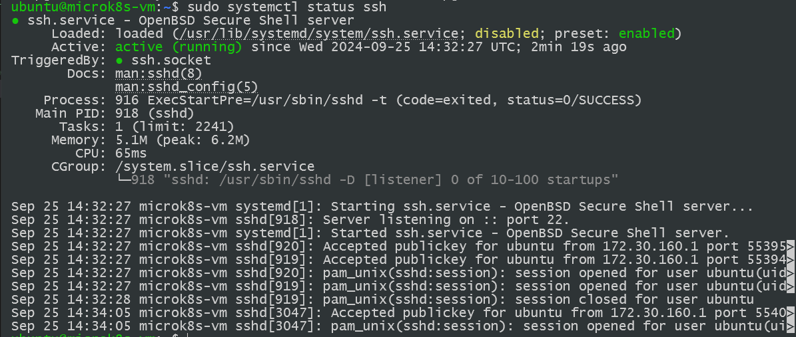
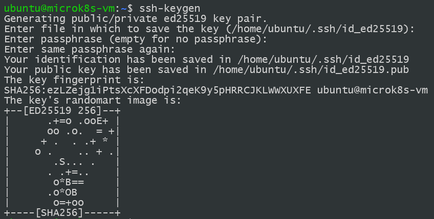

Das MicroK8s Cluster wird in einer VM von Multipass aufgesetzt.  

# Erstellen einer Multipass Instanz

Für das Aufsetzen eines MicroK8s Clusters wird auf der offiziellen [MicroK8s Homepage](https://microk8s.io/) 
[Multipass](https://multipass.run/) empfohlen. 
Für die Windowsinstallation wird direkt auf ein Installer verlinkt, 
der ein existierenden MicroK8s Cluster aufsetzt. 
Es wird eine VM mit 4 CPUs, 4G RAM und 40 GB an Speicher. 
Für unsere Testzwecke sind die Ressourcen-Empfehlungen mehr als Ausreichend und 
haben entsprechend jeweils nur die Hälfte zugewiesen. 


Nachdem die VM hochgefahren ist, 
direkt über die Multipass GUI Shell mit der VM interagiert werden, 
oder man kann direkt über ein Terminal mit der Instanz interagieren: 
<br>
`$ multipass start <name>` <br>
`$ multipass shell <name>` <br>
`$ multipass restart <name>` <br>

Für das erstellen einer neuen Instanz kann ebenfalls das Terminal verwendet werden: 
<br>
`$ multipass launch -n <name> -c <cpus> -m <memory> -d <disk space>`

Es kann noch ein `--image` Argument übergeben werden, um ein spezifisches Image auszuwählen, 
als Standard wird das neuste Ubuntu LTS System genutzt. 
Wir arbeiten mit der Ubuntu Version 24.04.01. 


Sobald die VM hochgefahren ist, 
wird eine SSH Verbindung in der VM eingerichtet, 
um sich auch außerhalb der VM mit dem Cluster zu verbinden. 

# Setup der SSH Verbindung

Zuerst muss apt geupdated werden und darauf der openssh-client installiert werden.
<br>
`$ sudo apt update && sudo apt upgrade` <br>
`$ sudo apt install openssh-client` <br>

Danach wird überprüft ob die ssh-Verbindung steht: 
<br>
`$ sudo systemctl status ssh`



Somit läuft die SSH Verbindung auf der VM:
`Active: active (running) since Wed 2024-09-25 14:32:27 UTC; 2min 19s ago`.

In unserem fall müssen wir ssh in der Firewall noch aktiviren: 
<br>
`$ sudo ufw allow ssh` <br>
`$ sudo systemctl enable ssh` <br>

Danach muss die IP Adresse der Linux-VM mit `ifconfig` ausgelesen werden:
<br>
`$ sudo apt install net-tools` <br>
`$ ifconfig` <br>

```shell
eth0: flags=4163<UP,BROADCAST,RUNNING,MULTICAST>  mtu 1500
        inet 172.30.169.161  netmask 255.255.240.0  broadcast 172.30.175.255
        inet6 fe80::5054:ff:fee3:86bf  prefixlen 64  scopeid 0x20<link>
        ether 52:54:00:e3:86:bf  txqueuelen 1000  (Ethernet)
        RX packets 4606  bytes 1326666 (1.3 MB)
        RX errors 0  dropped 0  overruns 0  frame 0
        TX packets 4631  bytes 564837 (564.8 KB)
        TX errors 0  dropped 0 overruns 0  carrier 0  collisions 0
```

In unsrem Fall ist die IP: `172.30.169.161`. Somit kann sich über die IP und dem Username des Linux Rechners mit der VM verbunden werden: `ssh ubuntu@172.30.169.161`. 

## SSH-Authentifizierung

Damit die SSH-Verbindung aufgebaut werden kann, 
muss entweder ein Username mit Password auf der VM Instanz gesetzt werden, 
oder man verbindet sich über die Public Key Authentifizierung. 
Wir haben uns für das letzte entscheiden, 
um einerseits mehr mit SSH zu arbeiten und dies zu üben, 
als auch für eine sichere und schnellere Verbindung. 
Sobald die Keys gesetzt sind, 
kann die Verbindung ohne Login aufgebaut werden. 
<br>
`$ ssh-keygen`



Standardgemäß wird der SSH Key unter `/<your_home/.ssh/id_rsa>` gespeichert.  
Außerdem kann ein Passphrase für die Keys angegeben werden. 
Danach muss in der VM noch der öffentliche Schlüssel von den Rechnern hinzugefügt werden, 
die sich mit der VM verbinden wollen. 

### OpenSHH Installation

In meinem Fall möchte ich mich von einem Windows Rechner in die VM Verbinden. 
Entsprechend habe ich mit OpenSSH ebenfalls Schlüssel generiert. 
Das Vorgehen funktioniert sehr ähnlich und wird auf der Microsoft Seite [Erste Schritte mit OpenSSH für Windows](https://learn.microsoft.com/de-de/windows-server/administration/openssh/openssh_install_firstuse) erklärt:
<br>
In PowerShell:<br>
`$ Get-WindowsCapability -Online | Where-Object Name -like 'OpenSSH*'` <br>
`$ Add-WindowsCapability -Online -Name OpenSSH.Client~~~~0.0.1.0` <br>
`$ Add-WindowsCapability -Online -Name OpenSSH.Server~~~~0.0.1.0` <br>

Output:
```bash
Path          :
Online        : True
RestartNeeded : False
```
`$ Start-Service sshd` <br>
`$ Set-Service -Name sshd -StartupType 'Automatic'` <br>

Zuletzt müssen noch die Ports in der WindowsFirewall freigegeben werden: <br>
```PowerShell
if (!(Get-NetFirewallRule -Name "OpenSSH-Server-In-TCP" -ErrorAction SilentlyContinue | Select-Object Name, Enabled)) {
    Write-Output "Firewall Rule 'OpenSSH-Server-In-TCP' does not exist, creating it..."
    New-NetFirewallRule -Name 'OpenSSH-Server-In-TCP' -DisplayName 'OpenSSH Server (sshd)' -Enabled True -Direction Inbound -Protocol TCP -Action Allow -LocalPort 22
} else {
    Write-Output "Firewall rule 'OpenSSH-Server-In-TCP' has been created and exists."
}
```

Jetzt kann in einem Windows-Terminal mit `$ ssh-keygen -t rsa` ebenfalls ein Schlüsselpaar generiert werden. 

### Hinzufügen eines Öffentlichen SSH Schlüssel in Linux

Der öffentliche Schlüssel von dem Rechner, 
der sich nun mit der Linux Instanz verbinden möchte, 
muss kopiert werden und auf dem Linux Rechner hinterlegt werden. 
Dafür muss das `.ssh` Verzeichnis in die File `authorized_keys` der öffentliche Schlüssel hinzugefügt werden und 
die Rechte auf das File entsprechend gesetzt werden.
<br>
`$ echo "<PUBLIC_KEY> >> ~/.ssh/authorized_keys"` <br>
`$ chmod 600 ~/.ssh/authorized_keys` <br>

Danach muss lediglich ssh neugestartet werden und es kann versucht werden, eine SSH-Verbindung aufzubauen:
<br>
`$ sudo systemctl restart ssh`

Auf meinem Windows Rechner:

```Powershell
C:\Users\Tobby
λ ssh ubuntu@172.30.169.161
The authenticity of host '172.30.169.161 (172.30.169.161)' can t be established.
ECDSA key fingerprint is SHA256:5cuD09ZKcsANuY9RW5kp0gI+34fzbS/UYTxsNSx3+10.
Are you sure you want to continue connecting (yes/no/[fingerprint])? yes
Warning: Permanently added '172.30.169.161' (ECDSA) to the list of known hosts.
Welcome to Ubuntu 24.04.1 LTS (GNU/Linux 6.8.0-45-generic x86_64)

 * Documentation:  https://help.ubuntu.com
 * Management:     https://landscape.canonical.com
 * Support:        https://ubuntu.com/pro

 System information as of Wed Sep 25 15:42:36 UTC 2024

  System load:  0.08               Processes:             108
  Usage of /:   10.2% of 18.33GB   Users logged in:       1
  Memory usage: 11%                IPv4 address for eth0: 172.30.169.161
  Swap usage:   0%


Expanded Security Maintenance for Applications is not enabled.

0 updates can be applied immediately.

Enable ESM Apps to receive additional future security updates.
See https://ubuntu.com/esm or run: sudo pro status


Last login: Wed Sep 25 14:34:05 2024 from 172.30.160.1
```
